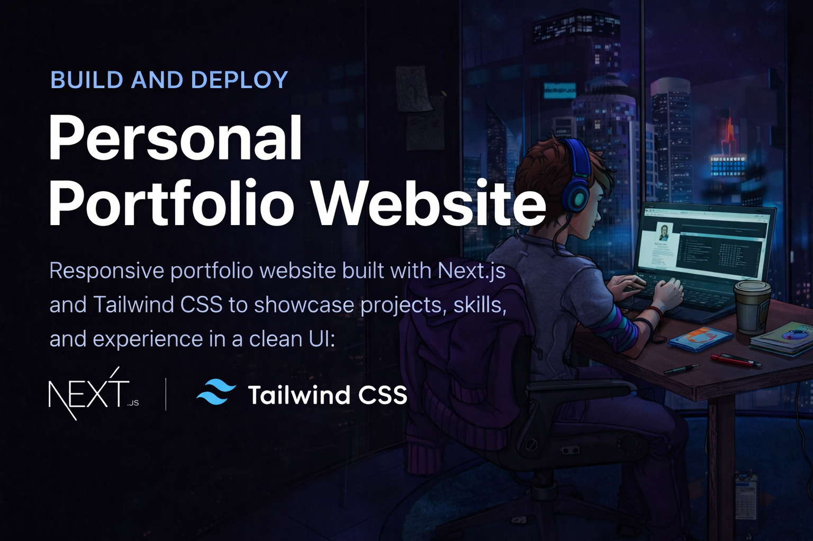

<br />

<div align="center">
 <div>
    
    
  </div>

  <h3 align="center">Developer-Portfolio</h3>

 <p align="center">
   Welcome to the repository for my personal portfolio website, built using Next.js, Tailwind CSS, and Resend for email functionality. This guide will help you set up and run the project locally.
  </p>
  <br />

  </div>
  
- [Overview](#overview)
- [Features](#features)
- [Technologies Used](#technologies-used)
- [File Structure](#file-structure)
- [Getting Started](#getting-started)
- [Prerequisites](#prerequisites)
- [Installation](#installation)
- [Running the Project](#running-the-project)
- [Environment Variables](#environment-variables)
- [Deployment](#deployment)
- [Contact](#contact)
- [License](#license)

## Overview

This is my personal portfolio website where i showcase my projects, skills, and experience. The website is designed to be fully responsive and includes features such as project showcases, a contact form, and more.

You can view the live portfolio at: [https://ktirumalaachari.vercel.app/](https://ktirumalaachari.vercel.app/)

## Features

- **Responsive Design**: Built with Tailwind CSS to ensure a seamless experience across all devices.
- **Next.js Framework**: Utilizes the powerful features of Next.js including routing, server-side rendering, and API routes.
- **Resend Integration**: Allows for secure and reliable email sending via the contact form.
- **Project Showcase**: Displays a curated list of personal projects with live links and GitHub repositories.

## Technologies Used

- **Next.js**: For building the React application with server-side rendering and static site generation.
- **Tailwind CSS**: For styling the application with utility-first CSS.
- **Resend**: For sending emails securely from the contact form.

## File Structure

Here's an overview of the project's file structure:

```plaintext
.
├── app                  # Contains Next.js app router pages and layout files
│   ├── api              # Resend API routes for handling requests
│   ├── globals.css      # Global styles using Tailwind CSS
│   ├── layout.jsx       # Main layout component
│   ├── page.jsx         # Home page component
│   └── ...              # Other Next.js specific files
├── components           # Reusable React components
├── public               # Static assets such as images and icons
├── .env                 # Environment variables
├── next.config.js       # Next.js configuration
├── tailwind.config.js   # Tailwind CSS configuration
└── package.json         # Project metadata and dependencies
```

## Getting Started

### Prerequisites

Ensure you have the following tools installed on your development machine:

- **Node.js** (version 16 or higher)
- **npm** or **yarn**

### Installation

Clone the repository to your local machine:

```bash
git clone https://github.com/ktirumalaachari/Developer-Portfolio.git
cd portfolio
```

Install the dependencies:

```bash
npm install
# or
yarn install
```

### Running the Project

To start the development server, run:

```bash
npm run dev
# or
yarn dev
```

Open your browser and navigate to `http://localhost:3000` to view the application.

## Environment Variables

The project requires the following environment variables. Create a `.env` file in the root directory and add your values:

```plaintext
RESEND_API_KEYY=your-resend-api-key
```

These variables are essential for connecting the contact form to the Resend email service.

## Deployment

To deploy the project, you can use platforms like Vercel (recommended for Next.js projects), Netlify, or any other hosting service that supports Node.js applications.

For example, to deploy with Vercel:

```bash
npm install -g vercel
vercel
```

Follow the prompts to deploy your application.

## License

This project is open-source and available under the [MIT License](LICENSE).

<div align="center">
  
## 👨‍💻 Author
**K Tirumala Achari**  
Full Stack Developer

[](https://github.com/ktirumalaachari)
[](https://ktirumalaachari.vercel.app/)
[](ktirumalaachari@gmail.com)
[](https://www.nist.edu/)

_Computer Science And Engineering Student_  
_NIST University, Berhampur Odisha India_

</div>
